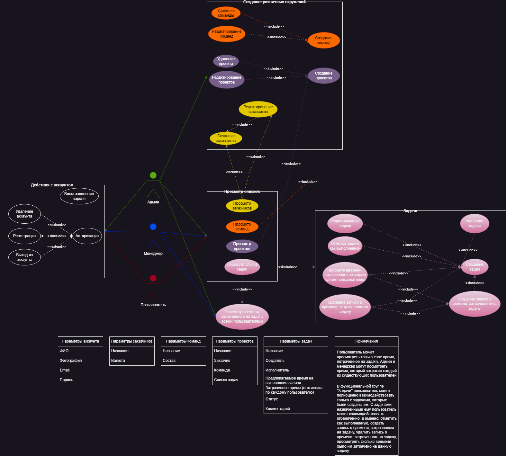
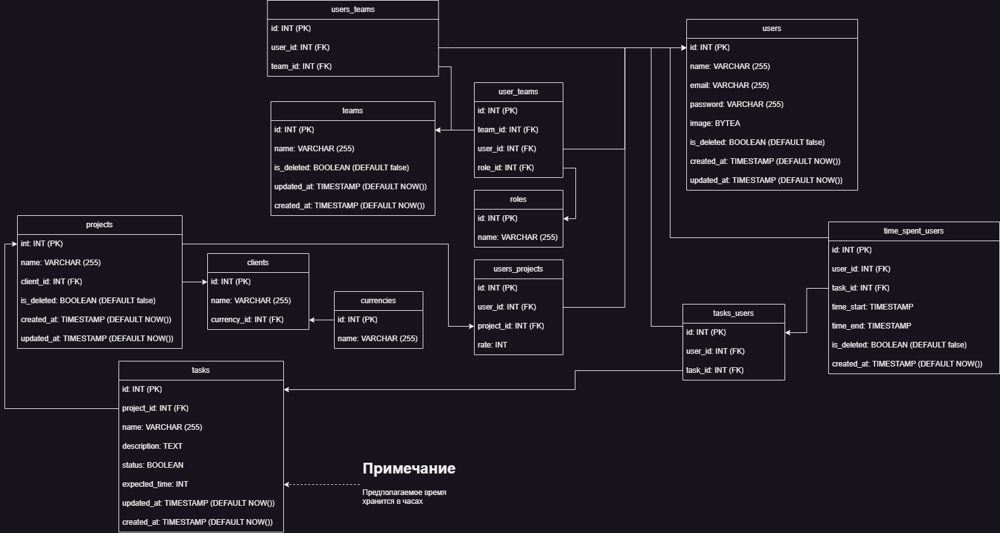

# Анализ конкуретнов

## Jira + Tempo Timesheets

### Ключевой функционал
1. Регистрация + авторизация
2. Бэклог:
   - Создание/редактирование задач:
     - Назначение исполнителя
     - Выбор метки
     - Выбор родителя
     - Назначение команды
     - Указание оценки сложности задачи
     - Автор задачи
     - Регистрация затраченного времени
     - Прикрепления ссылки
     - Прикрепление вложения
     - Добавление дочерней задачи
     - Изменение ограничений на редактирование
     - Поделиться задачей 
     - Добавление комментариев
     - Изменение статуса задачи
     - Экспорт задачи
     - Переместить задачу
     - Клонировать задачу
     - Удалить задачу
   - Создание/изменение спринтов:
     - Изменение названия
     - Указание временного промежутка
     - Завершение спринта
   - Эпик
   - Аналитика бэклога
3. Хронология:
   - Фильтрация по категории статуса
   - Календарь с изменением масштаба
   - Создание эпика
4. Доска
   - Canban доска
   - Группировка по исполнителю, эпику, подзадачам
   - Аналитика спринта
   - Настройки просмотра
   - Редактировать спринт
   - Управление рабочим процессом (установка правил для изменения статусов задачи)
   - Управление пользовательскими фильтрами 
   - Настройки доски (редактирование столбиков)
   - Завершить спринт
5. Список (просто список задач сплошной таблицей)
6. Цели (возможность устанавливать цели задач)
7. Настройки проекта
   - Название
   - Ключ проекта
   - Категория
   - Руководитель проекта
   - Исполнитель по умолчанию

### Преимущества

1. Можно настроить практически под любую команду, есть большое количество плагинов и дополнений.
2. Большое количество инструментов в частности для Agile команд.
3. Есть возможность создавать кастомизируемые отчеты для удовлетворения специфических требований.
4. Возможность интеграции таких инструментов как Confluence, Bitbucket, GitHub, Slack, Trello и т. д.
5. Возможность управления проектами на уровне компании (возможность создать много проектов и команд).

### Недостатки

1. Сложность настройки и обучения. Возможностей слишком много, из-за чего систему тяжело настроить и освоить, особенно новым пользователям.
2. Мобильное приложение недоступно в России.
3. Недоступна оплата из России.

### Итоги

Jira в первую очередь существует как таск-менеджер для команды, а Tempo Timesheets является лишь дополнением для контроля времени, затраченного на задачу. 

## Clockify

# Основной функционал

1. Проекты
   - Создание проекта
   - Просмотр списка проектов (на каждом проекте отображается затраченное на проект время и деньги)
   - Фильтры
   - Экспорт проектов
   - Просмотр конкретного проекта
     - Список задач
       - Название задач
       - Исполнители
     - Настройки доступа к проекту
     - Статус (по сути отчет по часам по каждой задаче и по проекту в общем)
     - Примечание проекта
     - Настройки проекта
2. Команда
   - Участники (отображается Email, роль, группа, есть возможность изменить ставку, отредактировать профиль)
   - Группы (доступно только создание)
3. Клиенты
   - Добавить клиента
   - Просмотреть список клиентов (отображается имя, валюта, адрес)
   - Редактирование клиентов (имя, электронный адрес, адрес, примечание, валюта)
4. Тэги
   - Создание тэгов
5. Таймер
   - Создание записи времени
      - Название задачи, над которой работает пользователь
      - Проект
      - Тэг
      - Возможность поставить неоплачиваемые часы
      - Таймер
6. Календарь
   - Просмотр календаря с временем когда были сделаны отметки о работе
7. Расписание
   - Указание стандартного времени, которое будет затрачено на определенную задачу или проект по дням недели
8. Дашборд
   - Просмотр статистики времени по дням недели
   - Топ проект
   - Верхний клиент (странный перевод, возможно это клиент, на которого было потрачено больше всего времени)
9. Отчеты
   - По времени (резюме, подробно, еженедельно, общий)
   - По команде (посещаемость, задания)
   - Расходы (подробно)

### Преимущества

1. Сервис хорошо проработан с точки зрения тайм-трекера
2. Есть поддержка многих платформ
3. Прост в освоении по сравнению с Jira

### Недостатки
1. Есть ошибки/неточности перевода
2. Сервис не развит с точки зрения таск менеджера
3. Отсутствуют любые инструменты для Agile команд
4. Нет деления на команды
5. Не удобно работать с большими проектами

### Итоги
Clockify подходит исключительно для учета врвемени работы мелкой команды, большим функционалом сервис просто не обладает.

## Функциональные рекомендации

Поскольку стоит задача сделать тайм-трекер, а не таск-менеджер, то опираться на функционал Jira при разработке собственного сервиса не целесообразно.
Сервис "Clockify" обладает примерным минимально необходимым набором функций тайм-трекера, поэтому будет целесообразно скопировать функционал этого приложения с некоторыми упущениями.

Следовательно, приложение должно обладать следующим функционалом:

1. Проекты
   - Создание проекта
   - Просмотр списка проектов (на каждом проекте отображается затраченное на проект время и деньги)
   - Фильтры
   - Просмотр конкретного проекта
     - Список задач
       - Название задач
       - Исполнители
       - Отметить задачу как выполненную
       - Редактировать задачу
       - Указать время, затраченную на конкретную задачу
     - Настройки проекта
2. Команда
   - Создание команды
   - Редактирование команды
   - Просмотр команд
     - Участники (отображается Email, роль, группа, есть возможность изменить ставку, отредактировать профиль)
3. Клиенты
   - Добавить клиента
   - Просмотреть список клиентов (отображается имя, валюта)
   - Редактирование клиентов (имя, валюта)
4. Отчеты по времени, затраченному на задачи
    - Для пользователей
    - Для задач
    - Для команд
    - Для проекта

### Диаграмма использования

### Схема базы данных

### [Спецификация в Swagger/OpenAPI](openapi.json)

### [Инструкция по использованию](instruction.md)
